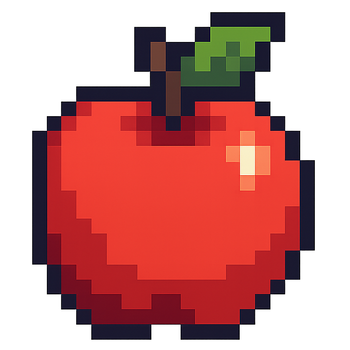
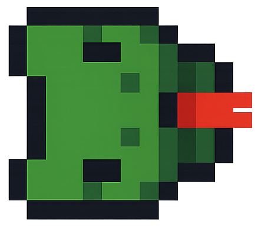
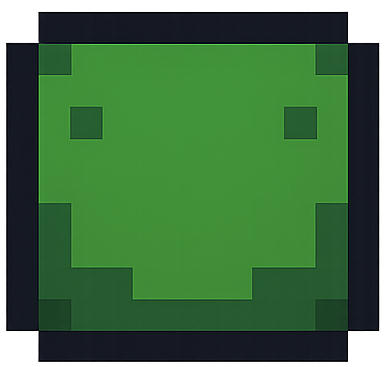
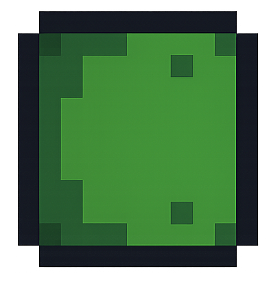

# Snake Game - User Manual

## Table of Contents
1. [Introduction](#introduction)
2. [Installation](#installation)
3. [Starting the Game](#starting-the-game)
4. [Game Controls](#game-controls)
5. [How to Play](#how-to-play)
6. [Game Rules](#game-rules)
7. [Scoring](#scoring)
8. [Tips and Strategies](#tips-and-strategies)
9. [Troubleshooting](#troubleshooting)

---

## Introduction

Welcome to Snake, a classic arcade game reimagined using modern graphics rendering! Guide your snake around the grid, eat food to grow longer, and try to achieve the highest score possible without crashing into walls or yourself.

This implementation features:
- Smooth sprite-based graphics
- Rotated snake head and tail for visual feedback
- 20x20 grid playing field
- Progressive difficulty as your snake grows longer

---

## Installation

### Requirements
- **Python 3.10 or higher**
- **DearPyGui 2.0 or higher**

### Installation Steps

1. **Ensure Python is installed**

   Check your Python version:
   ```bash
   python --version
   ```

   If you don't have Python 3.10+, download it from [python.org](https://www.python.org/downloads/)

2. **Install DearPyGui**

   Open your terminal or command prompt and run:
   ```bash
   pip install dearpygui
   ```

3. **Download the game files**

   Ensure you have:
   - `snake.py` (the main game file)
   - `sprites/` folder containing:
     - `apple.png`
     - `snake_head.png`
     - `snake_body.png`
     - `snake_tail.png`

---

## Starting the Game

1. Open your terminal or command prompt
2. Navigate to the game directory:
   ```bash
   cd path/to/PySnake
   ```
3. Run the game:
   ```bash
   python snake.py
   ```
4. A window will appear with the game ready to play

---

## Game Controls

### Movement Controls

You can control the snake using either **WASD keys** or **Arrow keys**:

| Key | Action |
|-----|--------|
| **W** or **↑** | Move Up |
| **A** or **←** | Move Left |
| **S** or **↓** | Move Down |
| **D** or **→** | Move Right |

### Other Controls

| Key | Action |
|-----|--------|
| **R** | Restart the game |
| **Restart Button** | Click to restart the game |

---

## How to Play

### Objective
Eat as much food as possible to grow your snake and increase your score without crashing into walls or your own body.

### Gameplay

1. **Starting Position**: The game begins with a small snake (just the head) positioned near the center of the grid

2. **Movement**: The snake moves continuously in the direction you choose. Press a direction key to change where the snake is heading

3. **Eating Food**: When the snake's head reaches the red food (apple), the snake grows by one segment and your score increases

4. **Growing**: Each time you eat food, a new segment is added to the tail of your snake

5. **New Food**: After eating, new food appears randomly on an empty grid space

6. **Game Over**: The game ends when you hit a wall or collide with your own body

### Visual Feedback

- **Snake Head**: A distinct sprite that rotates to face the direction of movement
- **Snake Body**: Middle segments of your snake
- **Snake Tail**: A distinct sprite at the end that rotates to show the direction from the previous segment
- **Food (Apple)**: A red apple sprite indicating where to move next
- **Grid**: Light gray lines showing the 20x20 playing field

### Game Graphics

Here are the sprites used in the game:

#### Food (Apple)


The apple is your target. Guide your snake's head to this position to eat it and grow.

#### Snake Head


The head of your snake, featuring eyes and a red tongue. This sprite rotates to face the direction you're moving (shown here facing right, the default direction).

#### Snake Body


The body segments that make up the middle of your snake. These segments don't rotate and appear the same regardless of direction.

#### Snake Tail


The tail end of your snake. This sprite rotates to show the connection direction from the previous body segment.

**Note**: All sprites use a pixelated art style to give the game a retro aesthetic while maintaining smooth rotation and rendering through DearPyGui's graphics engine.

---

## Game Rules

### Movement Rules

1. **Continuous Movement**: The snake never stops moving. It advances one grid square every 0.15 seconds (approximately 6.7 squares per second)

2. **Direction Change**: You can change direction at any time, but you cannot reverse directly into yourself:
   - Cannot go LEFT immediately after going RIGHT
   - Cannot go UP immediately after going DOWN
   - And vice versa

3. **Turn Queuing**: Only your most recent direction input is registered. Rapid key presses may not all be processed if you press multiple keys between movement updates

### Collision Rules

**Game Over occurs when:**

1. **Wall Collision**: The snake's head moves outside the 20x20 grid boundaries
   - Top wall: row 0
   - Left wall: column 0
   - Bottom wall: row 19
   - Right wall: column 19

2. **Self Collision**: The snake's head occupies the same grid position as any part of its body

### Food Rules

1. Food spawns randomly on any empty grid square
2. Food cannot spawn on squares occupied by the snake
3. Only one food item exists at a time
4. Food is automatically replaced when eaten

---

## Scoring

- **Starting Score**: 0
- **Points per Food**: +1 point for each food item eaten
- **Maximum Possible Score**: 399 (filling the entire 20×20 = 400 grid squares minus the starting position)

Your current score is displayed at the top of the game window. When the game ends, it will show "Game Over! Score: X" with your final score.

---

## Tips and Strategies

### For Beginners

1. **Take Your Time**: Don't rush. The snake moves at a constant speed, so plan your moves ahead

2. **Use the Walls**: Early in the game, you can move along the walls to avoid accidentally trapping yourself

3. **Watch Your Tail**: As your snake grows, always be aware of where your tail is positioned

4. **Think Two Moves Ahead**: Before changing direction, visualize where your snake will be in two moves

### Intermediate Strategies

1. **Create Patterns**: Develop systematic movement patterns (like spirals or zigzags) to cover the board safely

2. **Corner Awareness**: Corners are dangerous when you're long. Avoid getting trapped in corners with limited escape routes

3. **Center vs. Edges**:
   - Early game: Use edges and walls for easier navigation
   - Mid game: Move toward the center for more directional options
   - Late game: Carefully create safe paths as space becomes limited

4. **Food Positioning**: Sometimes it's better to avoid food if eating it would put you in a dangerous position

### Advanced Techniques

1. **Body Following**: Once your snake is long enough, you can follow your own tail since it moves out of the way as you advance

2. **Space Management**: Mentally divide the grid into sections and clear them systematically rather than moving randomly

3. **Escape Routes**: Before moving into any area, ensure you have a clear exit path

4. **Risk Assessment**: Evaluate whether going for food is worth the risk based on your current snake length and available space

---

## Troubleshooting

### Game Won't Start

**Error: "Sprite não encontrado em: ..."**
- **Cause**: Missing sprite files
- **Solution**: Ensure the `sprites/` folder is in the same directory as `snake.py` and contains all four PNG files (apple.png, snake_head.png, snake_body.png, snake_tail.png)

**Error: "No module named 'dearpygui'"**
- **Cause**: DearPyGui not installed
- **Solution**: Run `pip install dearpygui` in your terminal

**Error: Python version issues**
- **Cause**: Python version is older than 3.10
- **Solution**: Upgrade Python to version 3.10 or higher

### Performance Issues

**Game feels laggy or slow**
- Close other applications to free up system resources
- Ensure your graphics drivers are up to date
- Try running the game on a different computer if the issue persists

**Window doesn't appear**
- Check if the window opened behind other windows
- Try alt-tabbing to find the game window
- Restart the game

### Gameplay Issues

**Controls not responding**
- Make sure the game window is focused (click on it)
- Try using the alternative control scheme (WASD if using arrows, or arrows if using WASD)
- Press R to restart if the game is in a game-over state

**Game stuck after Game Over**
- Press **R** to restart
- Or click the **Restart** button at the top of the window

---

## Have Fun!

Remember, Snake is a game of patience and planning. Don't get discouraged if you crash early on - even experienced players make mistakes. Each game is an opportunity to improve your strategy and beat your high score!

**Good luck, and happy gaming!**
